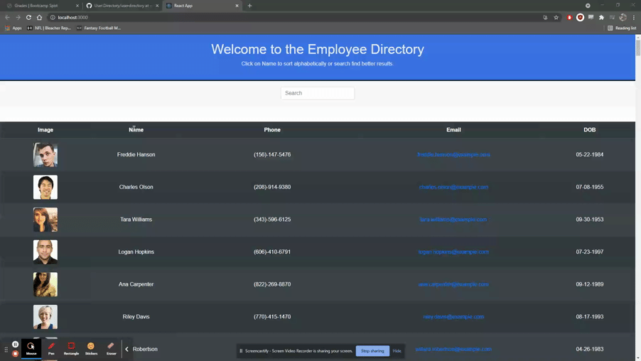

# User.Directory

## Description

For this assignment, you'll create a employee directory with React. This assignment will require you to break up your application's UI into components, manage component state, and respond to user events.
  
  
## Table of Contents
  * [User Story](#userstory)
  * [Business Context](#businesscontext)
  * [Usage](#usage)
  * [Links](#links)
  * [License](#license)
  * [Questions](#questions)
  
## User Story

* As a user, I want to be able to view my entire employee directory at once so that I have quick access to their information

## Business Context

An employee or manager would benefit greatly from being able to view non-sensitive data about other employees. It would be particularly helpful to be able to filter employees by name.

## Usage

## Links

  * Application URL: https://itsnestor.github.io/User.Directory/
  * Github Repository URL: https://github.com/itsnestor/User.Directory

## License

  
  

## Questions

  

  Reach out to me at nestor.dejoya.campaner@gmail.com with any questions about the project.